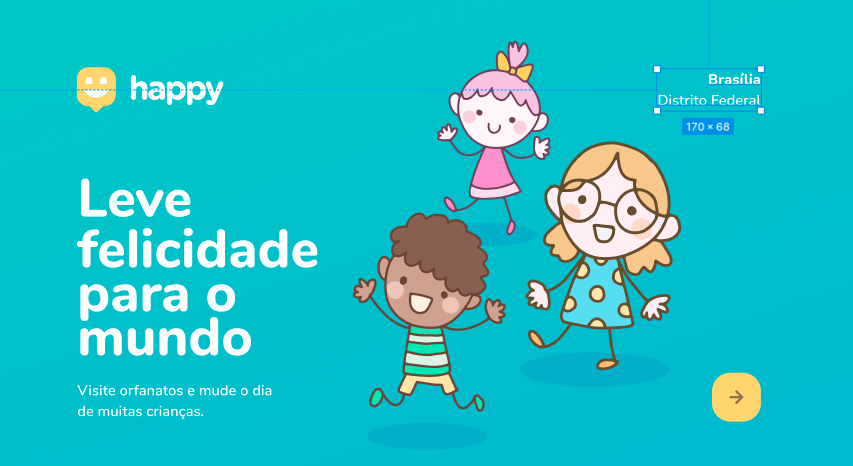

<h1 align="center">
 
  
 
 
NLW#3 -- Happy
</h1>

Nesta Next Level Week desenvolvemos uma aplicação web chamada Happy, que é uma plataforma onde pessoas podem buscar por orfanatos para visitas e se guiar pela localização, horário e disponibilidade de visitas.

  

## RECURSOS
Este aplicativo apresenta algumas ferramentas e práticas mais recentes em desenvolvimento Web!

- ⚛️ **JavaScript** — Linguagem de Programação front-end e Back-end.
- ⚛️ **SQLite** — É um Sistema Gerenciador de Banco de dados.
- 💹 **HTML5** — É uma linguagem de marcação utilizada na construção de páginas na Web.
- 💹 **CSS3** — É um mecanismo para adicionar estilo a um documento web.

## Licença

Este projeto está licenciado sob a Licença MIT - consulte a página [LICENSE](https://opensource.org/licenses/MIT) página para detalhes.
