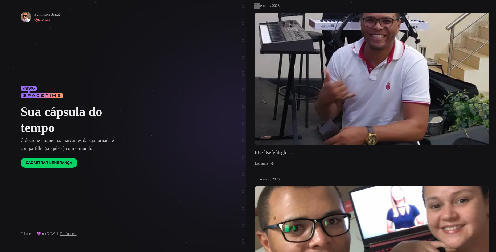

# Spacetime

---

É uma aplicação "linha do tempo" que o usuário logado pode ir adicionando com o tempo eventos importante que acontecem sua vida. Que além da data pode ser adicionado uma midia(foto ou video) e uma breve descrição sobre o momento tendo a opçao de deixar esse evento público.

<h1 align="center">
  
</h1>

---

## :point_right: Tecnologias

--- 

Toda a base dessa aplicação foi desenvolvida durante a semana NLW 12 da [Rocketseat](https://rocketseat.com.br) 
-  ⚛️ [ReactJs](https://reactjs.org/)
-  ⚛️ [REACT NATIVE](https://reactnative.dev/)
-  ⚛️ [NextJs](https://nextjs.org/)
-  ⚛️ [TYPESCRIPT](https://www.typescriptlang.org/)
-  ⚛️ [FASTIFY](https://www.fastify.io/)
-  ⚛️ [Tailwind CSS](https://tailwindcss.com/)
-  ⚛️ [NODE](https://nodejs.org/en)
-  ⚛️ [PRISMA](https://www.prisma.io/)
-  ⚛️ [EXPO](https://expo.dev/)

## :heavy_check_mark: Pré-requisitos
---

Antes de começar, você vai precisar ter instalado em sua máquina as seguintes ferramentas:
[Git](https://git-scm.com), [ReactJs](https://reactjs.org/). 
Além disto é bom ter um editor para trabalhar com o código como [VSCode](https://code.visualstudio.com/)

### 🎲 Rodando a Aplicação

```bash
# Clone este repositório
$ git clone <https://github.com/edimilsonbraz/moveit>

# Acesse a pasta do projeto no terminal/cmd
$ cd moveit

# Instale as dependências
$ yarn install

# Execute a aplicação em modo de desenvolvimento
$ yarn dev

# O servidor inciará na porta:3000 - acesse <http://localhost:3000>
```

## :computer: Licença

---

<p align="center">
  <a href="https://opensource.org/licenses/MIT">
    
  </a>
</p>


## :computer: Autor

---

<a href="#">
 
 <br /
 <sub><b>Edimilson Braz</b></sub></a>🚀


Feito com ❤️ por Edimilson Braz 👋🏽 Entre em contato!

[](https://www.linkedin.com/in/edimilsonbraz/) 
[](mailto:edimilson.gt8@gmail.com)
