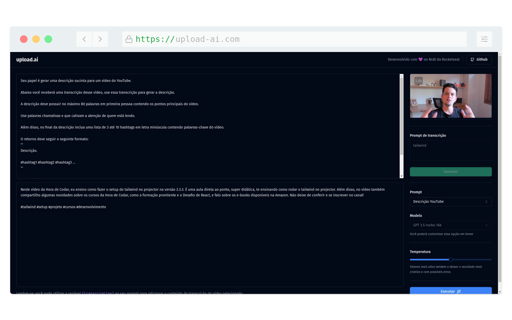

# NLW-AI
Este projeto foi desenvolvimento durante a NLW-AI(Next Level Week) da Rocketseat.

---
<h1 align="center">
  
</h1>

## :computer: Projeto
Construimos uma aplicação Front e Back completa usando IA pra gerar uma descrição suficiente e uma lista de títulos para vídeos que serão postados no youtube.

## :point_right: Tecnologias

Toda a base dessa aplicação foi desenvolvida durante a semana NLW AI da [Rocketseat](https://rocketseat.com.br) 

-  ⚛️ React
-  ⚛️ Typescript
-  ⚛️ Shadcn-ui
-  ⚛️ Tailwind-css
-  ⚛️ ChatGPT
-  ⚛️ Axios
-  ⚛️ Axios
-  ⚛️ Prisma
-  ⚛️ Fastify
-  ⚛️ openai
-  ⚛️ zod

---
 

## :computer: Licença

  

---
 

## :computer: Autor

<a href="#">
 
  
 <b>Edimilson Braz</b></a>🚀

Feito com ❤️ por Edimilson Braz 👋🏽 Entre em contato!

 
