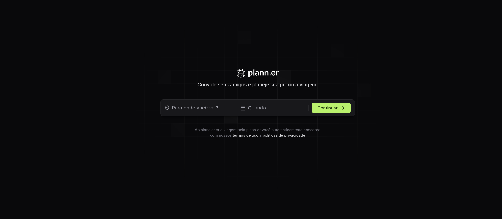
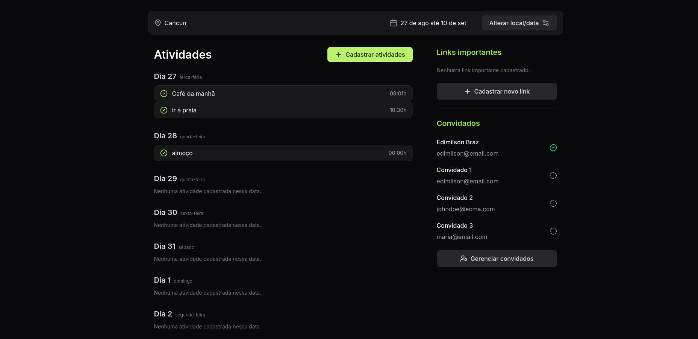

# NLW JOURNEY (reactjs)

---

É uma aplicação que funciona como um organizador de viagens seja entre amigos, entre familiares. A ideia é que uma pessoa cadastre sua viagem e convide todas as outras que farão parte da viagem e essas confirmarão sua presença por e-mail.

<h1 align="center">
  
</h1>
 <br />
<h1 align="center">
  
</h1>

---

## :point_right: Tecnologias

--- 

Toda a base dessa aplicação foi desenvolvida durante a NLW 16 da [Rocketseat](https://rocketseat.com.br) 
-  ⚛️ [Vite](https://vitejs.dev/)
-  ⚛️ [ReactJs](https://reactjs.org/)
-  ⚛️ [TYPESCRIPT](https://www.typescriptlang.org/)
-  ⚛️ [Tailwind CSS](https://tailwindcss.com/)

## :heavy_check_mark: Pré-requisitos
---


### 🎲 Rodando a Aplicação

```bash
# Clone este repositório
$ git clone <https://github.com/edimilsonbraz/all-nlw-rocketseat/tree/master/nlw_15-journey/frontend>

# Acesse a pasta do projeto no terminal/cmd
$ cd nlw_15-journey/frontend

# Instale as dependências
$ npm install

# Execute a aplicação em modo de desenvolvimento
$ npm run dev

# O servidor inciará na porta:5173 - acesse <http://localhost:5173>
```

## :computer: Licença


<p align="center">
  <a href="https://opensource.org/licenses/MIT">
    
  </a>
</p>

---


## :computer: Autor


<a href="#">
 
 <br />
 <sub><b>Edimilson Braz</b></sub></a>🚀


Feito com ❤️ por Edimilson Braz 👋🏽 Entre em contato!

[](https://www.linkedin.com/in/edimilsonbraz/) 
[](mailto:edimilson.gt8@gmail.com)
